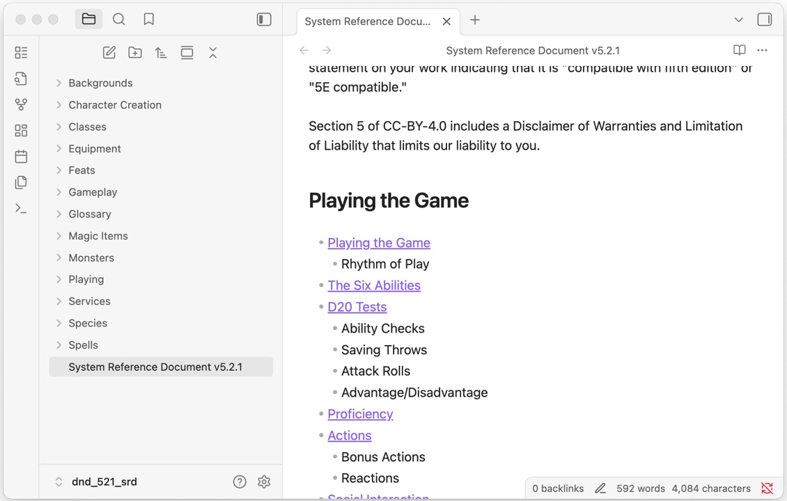

5e refererences in Markdown
===========================

The fifth edition reference documents that have been released under
[Creative Commons Attribution 4.0 International License \("CC-BY-4.0"\)][cc],
reformatted into Markdown.

[cc]: https://creativecommons.org/licenses/by/4.0/

Other than as needed during the conversion from PDF to Markdown, no changes
have been made to the text, tables, or details. Any changes are noted with
the SRD in question.

Each is available as a whole Markdown file, smaller segments broken up in a
(hopefully) useful manner, and as a packaged Obsidian vault.



## Available SRDs

- D&D 5th edition 5.1 SRD (2014 rules)

    - [PDF](dnd/51/SRD_CC_v5.1.pdf)
    - [Markdown (untouched)](dnd/51/SRD_CC_v5.1.untouched.md)
    - [Markdown (cleaned, one file)](dnd/51/SRD_CC_v5.1.md)
    - [Markdown (broken into sections)](dnd/51/markdown)
    - [Obsidian vault (.zip)](https://github.com/your5e/5e-srd-markdown/releases/latest/download/dnd_51_srd.zip)

    > This work includes material taken from the System Reference Document 5.1
    > ("SRD 5.1") by Wizards of the Coast LLC and available at
    > <https://dnd.wizards.com/resources/systems-reference-document>.
    > The SRD 5.1 is licensed under the Creative Commons Attribution 4.0
    > International License available at
    > <https://creativecommons.org/licenses/by/4.0/legalcode>.

    Conversion notes:

    - Markdown doesn't support multiple header rows as used in class tables, so
      they have been compressed to one row.
    - added "Traits" header in statblocks to create a clarity separator
      between the list of skills/senses/CR etc and the list of traits
    - fixed "Components" typo in Contagion
    - changed "Petrifying Gaze" to be bold italics for consistency
    - Some tables have been broken into section to make them clearer, as
      Markdown doesn't support mid-table headers:
        - Armor types ([Armor](dnd/51/markdown/equipment/armor.md))
        - Saddles ([Mounts and Vehicles](dnd/51/markdown/equipment/mounts_and_vehicles.md))
        - Scrying ([Scrying](dnd/51/markdown/spells/5th_level/scrying.md))
        - Tack, Harness, and Drawn Vehicles ([Tools](dnd/51/markdown/equipment/tools.md))
        - Weapon types ([Weapons](dnd/51/markdown/equipment/weapons.md))
    - Re-arranged the order of the Fantasy-Historical Pantheons so that the
      table of deities appears in the description of that pantheon
    - Subclass introduction headers added to Barbarian, Bard, Cleric & Druid
    - The monster ability tables have been reformatted to be in a different
      layout -- score/modifier/saving throw -- and the "Saving Throw" line
      underneath removed now it is incorporated into the table

- D&D 5th edition 5.2.1 SRD (2024 rules)

    - [PDF](dnd/521/SRD_CC_v5.2.1.pdf)
    - [Markdown (untouched)](dnd/521/SRD_CC_v5.2.1.untouched.md)
    - [Markdown (cleaned, one file)](dnd/521/SRD_CC_v5.2.1.md)
    - [Markdown (broken into sections)](dnd/521/markdown)
    - [Obsidiant vault (.zip)](https://github.com/your5e/5e-srd-markdown/releases/latest/download/dnd_521_srd.zip)

    > This work includes material from the System Reference Document 5.2.1
    > ("SRD 5.2.1") by Wizards of the Coast LLC, available at
    > <https://www.dndbeyond.com/srd>. The SRD 5.2.1 is licensed under the
    > Creative Commons Attribution 4.0 International License, available at
    > <https://creativecommons.org/licenses/by/4.0/> legalcode.

    Conversion notes:

    - removed the table of contents from the Markdown (where it makes no sense)
    - created a version of the table of contents along with lists of spells,
      magic items, monsters, and animals in the Obsidian vault
    - fixed numbering of steps in D20 tests (its 4, 5, 6 in the PDF, which
      seems to be an accidental continuation from Rhythm of Play)
    - Tables and sidebars have been repositioned in the source to where they
      make sense, rather than preserving the original document order, and
      table headers (and references to them) have been removed as a result
    - Corrected occurrences of "on \[the\] table" to "in \[the\] table"
    - Tables are reformatted for Markdown:
        - Markdown doesn't support multiple header rows as used in many tables
          (eg. in class features, the spanning "spell slots per spell level"),
          so the text has been adjusted to be only one row
        - restructured side-by-side tables used to reduce height in the PDF,
          including rotating statblock tables to have the abilities in the
          first column
        - split tables using mid-table headers into multiple tables
        - monster ability tables have been reformatted to be in the format
          score/modifier/saving throw

## Workflow for breaking the whole SRD into sections

### Create Markdown files

Create the Markdown using [marker](https://github.com/datalab-to/marker):

```bash
marker_single --output_dir . --output_format markdown SRD_CC_v5.1.pdf
```

Place the resulting Markdown to the right place (`srd/51/SRD_CC_v5.1.md`),
keep a pristine copy (`srd/51/SRD_CC_v5.1.untouched.md`), and copy it to
`breakdown.md` for processing into smaller files.

A draft breakdown is made with

```bash
./initial_breakdown.sh dnd/51/SRD_CC_v5.1.md > dnd/51/breakdown.txt
```

and then refined by hand (as either `marker` detects far too many lines as
headers, or the PDF was styled poorly). While refining the breakdown, this
can be run repeatedly to spot mistakes:

```bash
cp dnd/51/SRD_CC_v5.1.md dnd/51/breakdown.md \
    && ./breakdown.sh -fh dnd/51/breakdown.md \
    && diff -u dnd/51/SRD_CC_v5.1.md <(./rebuild.sh dnd/51/breakdown.md)
```


### Clean the Markdown

Once the breakdown has been created, start looping over refinement and repair
of the SRD Markdown using `./reprocess.sh`:

```bash
./reprocess.sh dnd/51/SRD_CC_v5.1.md
```

Without other arguments, it will:

- `git restore` the files being cleaned, to always be working with a
  predictable starting base (this can be skipped with `-b`)

- run the clean script, which reformats the document to remove PDF decoding
  errors, change formatting to the preferred format, and scan for errors
  that are hard to fix programmatically (this can be skipped with `-c`)

    ```bash
    python clean_srd.py \
        --progress \
        $ignore_warnings \
            "$srd_path" "$breakdown_txt"
    ```
- break down the content to individual files (this can be skipped with `-b`)

- rebuild the SRD from the broken down content to compare with the original,
  to spot breakdown.txt problems, header level issues and more (this can
  be skipped with `-d`)

- filter the content again to create a cross-linked Obsidian vault (which is
  also often the easiest way to examine individual sections in isolation to
  find problems; this can be skipped with `-v`)

If warnings are emitted during cleaning that can be safely ignored, they can
be added to an `ignore_warnings.txt` file. Similarly, if any source would be
modified in an unwanted manner, those lines can be added to a
`clean_lines.txt` file.

When changing the original SRD Markdown by hand and lines are added/removed, use
`alter_lines.sh` to change the line numbers in `breakdown.txt` and
`ignore_warnings.txt` from a specific point in the breakdown onwards:

```bash
./alter_lines.sh -d dnd/51/ /black_tentacles -2
```

### Fixing header progression

The broken down fragments of the SRD should start with a first level header.
To help this, `breakdown.sh` fixes easy segments, and warns on any where the
headers skip around too much. Fixing can be turned off using the `-h` option
to `reprocess.sh`, or `-f` to `breakdown.sh` if using it directly. Likewise,
warnings can be supressed with `-h` to `reprocess.sh`, or `-c` when using
`breakdown.sh` directly.

Any warnings can be piped to `edit_warnings.sh` to open the file at the right
line (in Sublime Text):

```bash
./breakdown.sh | ./edit_warnings.sh

# or using the clipboard...
pbpaste | ./edit_warnings.sh
```

### Patching content

It can be helpful to add/alter content from the SRD to improve the state of
the vault content, by adding links etc. From a clean git state, edit the files
then run

```bash
# to patch the breakdown files
./patches.sh dnd/51/markdown create

# to patch only the vault
./patches.sh dnd/51/obsidian_vault create
```

In general, patch the original Markdown files if you want to add more content
so the vault filters apply, and patch the vault if the filters are doing the
wrong thing (such as linking to the condition Invisible when referring to the
Invisible Stalker).

Patches are kept rather than changing the content so that automated tests
still pass when comparing the Markdown fragments to the original document.


## Changing the code

Every script should have a test suite. Every filter in the `clean_srd.py`
and `update_vault.py` scripts should be individally tested, as well as having
whole-document integration tests.

- `make test` runs all the code tests
- `make ci` runs all the code tests, and a couple more
- `bats tests/clean/clean.bats` runs only the clean test suite

Strategy for adding a new SRD is create a new profile with no filters, break
the file down into its component parts to more easily identify which filters
are needed or will need to be written. As more filters are added to the
profile, the end result will start to take shape, making it easier to identify
which parts need changing by hand vs need a filter written.

(My rule of thumb is if it occurs more than a handful of times, or can be
obviously fixed with code, it gets a filter, otherwise I just do it by hand.)

When adding a new filter, first identify examples from the SRD, copy them
to the new filter test file, and fix them in isolation. Then clean the SRD
to find other examples where the format might be slightly different. Adjust
the code and tests until you catch as many instances as possible.
